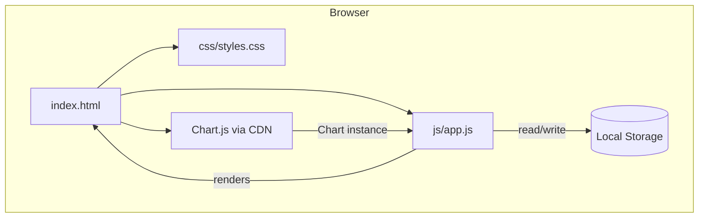
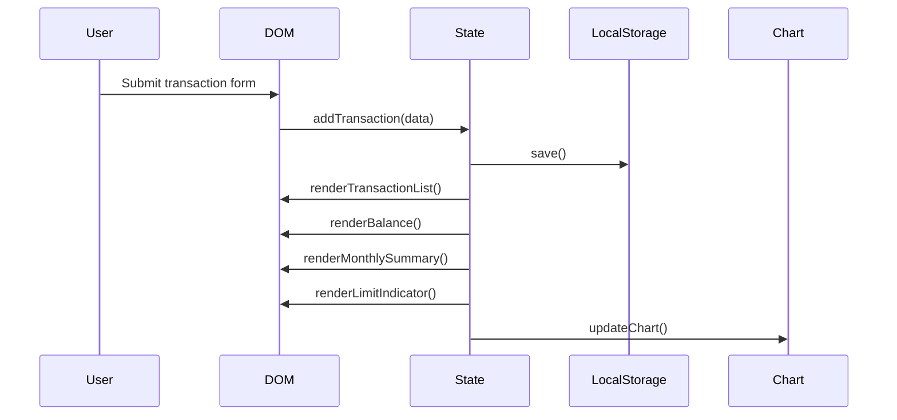

# Design Document: Expense & Budget Visualizer

## Overview

A single-page, client-side web application built with vanilla HTML, CSS, and JavaScript. No frameworks, no build step, no backend. All state lives in the browser's Local Storage. Chart.js is loaded via CDN for the pie chart.

The app is delivered as a single `index.html` that references one stylesheet (`css/styles.css`) and one script (`js/app.js`). On load, the script reads Local Storage, reconstructs application state, and renders the full UI. Every mutation (add/delete transaction, add/delete category, set spending limit, toggle theme) immediately syncs state back to Local Storage and re-renders the affected UI regions.

## Architecture



The JavaScript module follows a simple state-then-render pattern:

1. **State object** — a single plain object holding all app data in memory.
2. **Persistence layer** — thin wrappers around `localStorage.getItem` / `setItem` that serialize/deserialize the state object as JSON.
3. **Render functions** — pure-ish functions that read state and update the DOM. Each render function is responsible for one UI region (transaction list, balance, chart, monthly summary, limit indicator, category dropdown).
4. **Event handlers** — attached once on `DOMContentLoaded`; they mutate state, persist, and call the relevant render functions.



## Components and Interfaces

### index.html — Layout Regions

| Region | Element ID | Purpose |
|---|---|---|
| Theme toggle | `#theme-toggle` | Button to switch dark/light |
| Balance display | `#balance` | Shows total spending |
| Limit indicator | `#limit-indicator` | Hidden unless over budget |
| Transaction form | `#transaction-form` | Add new transaction |
| Sort control | `#sort-control` | `<select>` for sort order |
| Transaction list | `#transaction-list` | Scrollable `<ul>` |
| Chart canvas | `#spending-chart` | Chart.js pie chart |
| Monthly summary | `#monthly-summary` | Grouped monthly totals |
| Category manager | `#category-manager` | Add/delete custom categories |
| Spending limit input | `#limit-form` | Set/save spending limit |

### js/app.js — Public Interface (module-level functions)

```
// State
let state = {
  transactions: [],      // Transaction[]
  categories: [],        // string[]  (custom only; defaults always prepended)
  spendingLimit: null,   // number | null
  theme: 'light',        // 'light' | 'dark'
  sortOrder: 'default'   // 'default' | 'amount-asc' | 'amount-desc' | 'category-asc'
}

// Persistence
function loadState()          // reads LS, populates state
function saveState()          // serializes state → LS

// Mutations
function addTransaction(name, amount, category)
function deleteTransaction(id)
function addCategory(label)
function deleteCategory(label)
function setSpendingLimit(value)
function setTheme(theme)
function setSortOrder(order)

// Render
function renderAll()
function renderTransactionList()
function renderBalance()
function renderChart()
function renderMonthlySummary()
function renderLimitIndicator()
function renderCategoryDropdowns()
function renderCategoryManager()
```

### Chart.js Integration

A single `Chart` instance is created on first render and updated (not recreated) on subsequent renders via `chart.data.labels`, `chart.data.datasets[0].data`, and `chart.update()`. This avoids canvas flicker.

## Data Models

### Transaction

```js
{
  id: string,        // crypto.randomUUID() or Date.now().toString()
  name: string,      // non-empty, trimmed
  amount: number,    // positive float
  category: string,  // one of DEFAULT_CATEGORIES or custom categories
  date: string       // ISO 8601 date string (new Date().toISOString())
}
```

### AppState (Local Storage key: `"expense-app-state"`)

```js
{
  transactions: Transaction[],
  categories: string[],     // custom category labels only
  spendingLimit: number | null,
  theme: 'light' | 'dark',
  sortOrder: 'default' | 'amount-asc' | 'amount-desc' | 'category-asc'
}
```

### Default Categories

```js
const DEFAULT_CATEGORIES = ['Food', 'Transport', 'Fun']
```

All categories available in the dropdown = `[...DEFAULT_CATEGORIES, ...state.categories]`.

### Local Storage Layout

| Key | Value |
|---|---|
| `"expense-app-state"` | JSON-serialized `AppState` |

A single key holds the entire state. This keeps serialization and deserialization trivial and atomic.


## Correctness Properties

*A property is a characteristic or behavior that should hold true across all valid executions of a system — essentially, a formal statement about what the system should do. Properties serve as the bridge between human-readable specifications and machine-verifiable correctness guarantees.*

### Property 1: Valid transaction add grows the list

*For any* non-empty name, positive amount, and valid category, calling `addTransaction` should increase the length of `state.transactions` by exactly one.

**Validates: Requirements 1.2**

### Property 2: Transaction persistence round-trip

*For any* valid transaction added via `addTransaction`, serializing state to JSON and then deserializing it should produce a state whose `transactions` array contains a transaction with the same name, amount, and category.

**Validates: Requirements 1.3, 3.3, 6.1, 6.2**

### Property 3: Empty-field submissions are rejected

*For any* form submission where the name is an empty or whitespace-only string, or the category is absent, `addTransaction` should leave `state.transactions` unchanged.

**Validates: Requirements 1.4**

### Property 4: Non-positive amounts are rejected

*For any* amount that is zero, negative, or non-numeric, `addTransaction` should leave `state.transactions` unchanged.

**Validates: Requirements 1.5**

### Property 5: Form resets after successful add

*For any* successful `addTransaction` call, the transaction form's input fields should be empty/reset to their default values afterward.

**Validates: Requirements 1.6**

### Property 6: Transaction list renders all required fields

*For any* transaction in `state.transactions`, the rendered HTML of the transaction list should contain that transaction's name, formatted amount, and category.

**Validates: Requirements 2.1, 3.1**

### Property 7: State restore round-trip

*For any* app state object, serializing it to Local Storage and then calling `loadState` should produce an in-memory state that is deeply equal to the original.

**Validates: Requirements 2.3, 6.1, 7.5, 10.3, 11.4**

### Property 8: Default sort is most-recent-first

*For any* list of transactions in `sortOrder = 'default'`, the rendered order should place the transaction with the latest `date` at index 0.

**Validates: Requirements 2.4, 9.4**

### Property 9: Delete removes transaction from state

*For any* transaction present in `state.transactions`, calling `deleteTransaction(id)` should result in a state where no transaction with that id exists.

**Validates: Requirements 3.2, 3.3**

### Property 10: Balance equals sum of all amounts

*For any* `state.transactions` array, `computeBalance(state.transactions)` should equal the arithmetic sum of all `transaction.amount` values (0 when the array is empty).

**Validates: Requirements 4.1, 4.2, 4.3, 4.4**

### Property 11: Chart data matches category totals

*For any* `state.transactions` array, the data array passed to the Chart instance should equal the per-category sums computed by grouping transactions by category.

**Validates: Requirements 5.1, 5.2, 5.3**

### Property 12: Monthly summary groups and totals correctly

*For any* `state.transactions` array, `computeMonthlySummary(transactions)` should return an object where each key is a `YYYY-MM` string and each value equals the sum of amounts for transactions whose `date` falls in that month.

**Validates: Requirements 8.1, 8.2, 8.3, 8.4**

### Property 13: Sort order is correct for all sort options

*For any* `state.transactions` array and any `sortOrder` value, `sortTransactions(transactions, sortOrder)` should return a list that satisfies the comparator for that sort option (amount ascending, amount descending, or category alphabetical).

**Validates: Requirements 9.2, 9.3**

### Property 14: Limit indicator visibility matches budget state

*For any* `state`, `shouldShowLimitIndicator(state)` should return `true` if and only if `state.spendingLimit` is a positive number and the sum of all transaction amounts strictly exceeds it; it should return `false` when no limit is set or when the total is at or below the limit.

**Validates: Requirements 10.4, 10.5, 10.6, 10.7**

### Property 15: Theme toggle is an involution

*For any* theme value `t` in `{'light', 'dark'}`, toggling the theme twice should return to `t` (i.e., `toggleTheme(toggleTheme(t)) === t`).

**Validates: Requirements 11.2, 11.3**

### Property 16: Category validation rejects empty and duplicate names

*For any* category label that is empty, whitespace-only, or already present in `[...DEFAULT_CATEGORIES, ...state.categories]`, `addCategory` should leave `state.categories` unchanged.

**Validates: Requirements 7.4**

### Property 17: Custom category add/delete round-trip

*For any* valid (non-empty, non-duplicate) category label, adding it then deleting it should leave `state.categories` in its original state.

**Validates: Requirements 7.2, 7.3, 7.7**

## Error Handling

| Scenario | Handling |
|---|---|
| Local Storage unavailable (private browsing, quota exceeded) | Wrap all LS calls in try/catch; app continues in-memory with a banner warning the user that data won't persist |
| Corrupted Local Storage JSON | `JSON.parse` failure caught; state reset to defaults and LS key cleared |
| Chart.js CDN fails to load | `window.Chart` check before instantiation; chart canvas replaced with a text message "Chart unavailable" |
| `crypto.randomUUID` unavailable (old browsers) | Fallback to `Date.now().toString() + Math.random()` for ID generation |
| Non-numeric amount input | Caught by `isNaN` / `parseFloat` check in form validation before state mutation |
| Duplicate category submission | Checked against combined default + custom list before mutation |

## Testing Strategy

### Dual Testing Approach

Both unit tests and property-based tests are required. They are complementary:

- **Unit tests** cover specific examples, integration points, and edge cases (empty state, single transaction, boundary values).
- **Property-based tests** verify universal invariants across hundreds of randomly generated inputs.

### Property-Based Testing

**Library**: [fast-check](https://github.com/dubzzz/fast-check) (JavaScript, no build step required — can be loaded via CDN in a test HTML page, or run with Node.js + a test runner).

Each property test must run a minimum of **100 iterations**.

Each test must include a comment tag in the format:
`// Feature: vanilla-web-app, Property N: <property text>`

| Property | Test description | Arbitraries |
|---|---|---|
| P1 | Valid add grows list by 1 | `fc.string({minLength:1})`, `fc.float({min:0.01})`, category from array |
| P2 | Persistence round-trip | same as P1 |
| P3 | Empty name rejected | `fc.string()` filtered to whitespace-only |
| P4 | Non-positive amount rejected | `fc.oneof(fc.constant(0), fc.float({max:0}))` |
| P5 | Form resets after add | same as P1 |
| P6 | List renders all fields | `fc.array(transactionArb)` |
| P7 | State restore round-trip | `fc.record({transactions, categories, spendingLimit, theme, sortOrder})` |
| P8 | Default sort most-recent-first | `fc.array(transactionArb, {minLength:2})` |
| P9 | Delete removes by id | `fc.array(transactionArb, {minLength:1})` |
| P10 | Balance = sum | `fc.array(transactionArb)` |
| P11 | Chart data = category totals | `fc.array(transactionArb)` |
| P12 | Monthly summary correct | `fc.array(transactionArb)` |
| P13 | Sort order correct | `fc.array(transactionArb)`, `fc.constantFrom('amount-asc','amount-desc','category-asc')` |
| P14 | Limit indicator visibility | `fc.array(transactionArb)`, `fc.option(fc.float({min:0.01}))` |
| P15 | Theme toggle involution | `fc.constantFrom('light','dark')` |
| P16 | Category validation | `fc.string()` (empty/whitespace/duplicate cases) |
| P17 | Category add/delete round-trip | `fc.string({minLength:1})` filtered to non-default |

### Unit Tests

Focus on:
- App loads with empty Local Storage → balance = 0, empty list, light theme
- App loads with pre-populated Local Storage → all state restored correctly
- Deleting the only transaction → balance = 0, chart shows empty state
- Spending limit set to exactly the current total → indicator hidden (not exceeded)
- Spending limit set to one cent below total → indicator shown
- Custom category appears in dropdown after add
- Custom category removed from dropdown after delete
- Transactions with same month/year grouped in monthly summary
- Transactions across two different months appear as two separate summary rows
